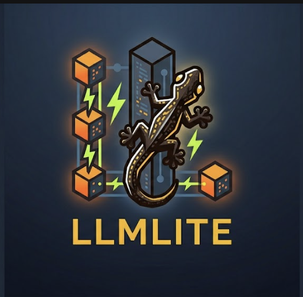

<p align="center">
  
</p>

# llmlite

**A lightweight, high-performance LLM SDK & Edge Router written in Zig**

[](https://github.com/zouyee/llmlite/actions)
[](https://ziglang.org/)
[](LICENSE)
[](build.zig)

## Overview

llmlite is a **zero-dependency, edge-ready LLM SDK and AI gateway** written in Zig. Unlike Python-based solutions (LiteLLM ~50MB, vLLM Semantic Router requires K8s/Docker), llmlite delivers:

- **Edge-Ready Binary** - 672KB single binary, no Docker/K8s required
- **Edge Scenarios** - Deploy on IoT devices, CLI tools, WASM, embedded systems
- **Zig Native** - Built with Zig 0.15+ for maximum performance and memory safety
- **Zero Dependencies** - Fully self-contained, no Python/Node.js runtime needed
- **Type Safety** - Compile-time checks eliminate runtime type errors

### Key Differentiators

| vs | llmlite Advantage |
|----|-------------------|
| **vLLM Semantic Router** | Native binary, no K8s/Docker, 672KB vs hundreds of MB |
| **LiteLLM** | 100x smaller (672KB vs 50MB+), zero runtime deps |
| **go-genai** | 7x smaller (672KB vs ~5MB), native Zig type safety |

## Quick Start

```bash
# Build for edge (672KB)
zig build -Doptimize=ReleaseSmall

# Run the proxy
./zig-out/bin/llmlite-proxy

# Or use as SDK
const llmlite = @import("llmlite");
```

## Edge Routing Features

llmlite-proxy includes production-grade edge routing:

| Feature | Description |
|---------|-------------|
| **Connection Pooling** | Per-provider HTTP connection reuse |
| **Latency Tracking** | Moving average, P50/P95/P99 percentiles |
| **Circuit Breaker** | CLOSED→OPEN→HALF_OPEN state machine |
| **Active Health Check** | Periodic provider probing |
| **Hot Reload** | Zero-downtime config updates |
| **Virtual Keys** | API key management with spend tracking |

### Edge Endpoints

```bash
# Health checks (K8s-compatible)
curl http://localhost:4000/health/live   # Liveness
curl http://localhost:4000/health/ready  # Readiness

# Prometheus metrics
curl http://localhost:4000/metrics
curl http://localhost:4000/metrics/latency  # Per-provider latency
```

## Architecture

```
┌─────────────────────────────────────────────────────────────┐
│  llmlite-proxy (672KB, zero dependencies)                    │
├─────────────────────────────────────────────────────────────┤
│  Edge Router                                               │
│  ├── Connection Pool (per-provider)                       │
│  ├── Latency Tracker (P50/P95/P99)                       │
│  ├── Circuit Breaker (auto-failover)                     │
│  ├── Active Health Checker                               │
│  └── Hot Config Reload                                   │
├─────────────────────────────────────────────────────────────┤
│  Gateway                                                   │
│  ├── Virtual Keys (sk-xxx)                               │
│  ├── Rate Limiting                                        │
│  ├── Cost Tracking                                        │
│  └── Simple + Semantic Cache                             │
├─────────────────────────────────────────────────────────────┤
│  Providers (12+ supported)                                 │
│  ├── OpenAI, Anthropic, Google Gemini                    │
│  ├── Moonshot/Kimi, Minimax, DeepSeek                    │
│  └── + 6 more OpenAI-compatible                         │
└─────────────────────────────────────────────────────────────┘
```

## Comparison with Other Solutions

| Feature | llmlite | vLLM Semantic Router | LiteLLM |
|---------|---------|---------------------|---------|
| **Binary Size** | 672KB | ~500MB (Docker) | 50MB+ |
| **Runtime Deps** | None | Docker/K8s | Python + pip |
| **Type Safety** | Full | Partial | Partial |
| **Edge Deploy** | ✅ Native | ❌ | ❌ |
| **Circuit Breaker** | ✅ Built-in | ❌ | ❌ |
| **Latency Metrics** | ✅ P50/P95/P99 | ❌ | ⚠️ |
| **Hot Reload** | ✅ | ❌ | ⚠️ |

## Supported Providers

| Provider | Core API | Advanced APIs | Status |
|----------|----------|---------------|--------|
| **Google Gemini** | ✓ Chat, Embeddings | ✓ Caches, Tunings, Documents, Tokens, FileSearch, Operations, Live | ✓ Stable |
| **OpenAI** | ✓ Chat, Embeddings, Files | ✓ Streaming, Tools | ✓ Stable |
| **Minimax** | ✓ Chat, Embeddings, TTS | ✓ Video, Image, Music | ✓ Stable |
| **Kimi (Moonshot)** | ✓ Chat, Files | ✓ Token Estimation, Balance, Thinking, Partial Mode | ✓ Stable |
| **OpenAI-Compatible** | ✓ Via OpenAI compatibility layer | - | ✓ Via Proxy |

### Provider Features Matrix

| Feature | OpenAI | Gemini | Minimax | Kimi |
|---------|--------|--------|---------|------|
| **Chat Completions** | ✓ | ✓ | ✓ | ✓ |
| **Streaming** | ✓ | ✓ | ✓ | ✓ |
| **Embeddings** | ✓ | ✓ | ✓ | - |
| **Vision/Images** | ✓ | ✓ | - | ✓ |
| **Files API** | ✓ | - | - | ✓ |
| **Function Calling** | ✓ | - | - | ✓ |
| **JSON Mode** | ✓ | ✓ | - | ✓ |
| **Context Caching** | - | ✓ | - | - |
| **Model Tuning** | - | ✓ | - | - |
| **Token Counting** | - | ✓ | - | ✓ |
| **TTS/Audio** | - | - | ✓ | - |
| **Video Generation** | - | - | ✓ | - |
| **Image Generation** | - | - | ✓ | - |
| **Music Generation** | - | - | ✓ | - |
| **Thinking Mode** | - | - | - | ✓ |
| **Partial Mode** | - | - | - | ✓ |
| **Balance Query** | - | - | - | ✓ |

### OpenAI-Compatible Providers

Any OpenAI-compatible API endpoint works out of the box. The following providers are pre-configured:

| Provider | Base URL | Notes |
|----------|----------|-------|
| **Anthropic** | api.anthropic.com | Claude models |
| **Moonshot/Kimi** | api.moonshot.cn | Kimi models |
| **DeepSeek** | api.deepseek.com | DeepSeek models |
| **Cohere** | api.cohere.ai | Command models |
| **Fireworks** | api.fireworks.ai | Fireworks models |
| **Cerebras** | api.cerebras.ai | Fast inference |
| **Mistral** | api.mistral.ai | Mistral models |
| **Perplexity** | api.perplexity.ai | Real-time models |

> **Note**: All above providers use OpenAI-compatible API format via the unified `language_model.zig` handler. They work out-of-the-box with the proxy server.

### API Documentation

Detailed provider documentation available in [docs/providers/](docs/providers/):

- [OpenAI](docs/providers/openai.md) - Chat, Embeddings, Files, Tools
- [Google Gemini](docs/providers/google-gemini.md) - Chat, Embeddings, Caches, Tunings, Documents, Tokens
- [Minimax](docs/providers/minimax.md) - Chat, TTS, Video, Image, Music
- [Kimi](docs/providers/kimi.md) - Chat, Files, Token Estimation, Balance, Thinking Mode

## Features

### Core Capabilities
- **Text Generation** - Generate content with customizable parameters
- **Streaming Responses** - Real-time streaming with SSE support
- **Embeddings** - Generate text embeddings for RAG applications
- **Chat Completions** - Multi-turn conversational AI

### Proxy Server (AI Gateway / Edge Router)
- **Edge Routing** - Connection pooling, latency tracking, circuit breaker
- **Virtual Key Management** - Create, revoke, track API keys
- **Multi-Provider Router** - Automatic failover, health tracking
- **Rate Limiting** - Per-key QPS and quota controls
- **Cost Tracking** - Real-time spend monitoring by key/team/model
- **Team/Project Management** - Multi-tenancy with budget limits
- **Simple Cache** - TTL-based in-memory response caching
- **Semantic Cache** - Embedding-based similarity caching for duplicate detection
- **Hot Reload** - Zero-downtime configuration updates

### Local Model Support (Planned)
- **Ollama Integration** - Connect to local Ollama servers via OpenAI-compatible API
- **llama.cpp Binding** - Direct GGUF model loading (future)

### Advanced APIs (Gemini)
- **Context Caching** - Cache frequently used context for cost savings
- **Model Tuning** - Fine-tune models for specific use cases
- **Document Management** - Manage documents for RAG pipelines
- **Vector Search Stores** - Create searchable vector databases
- **Token Counting** - Count tokens before API calls
- **Batch Processing** - Process multiple requests efficiently
- **Real-time Live** - Bidirectional streaming for live applications

### Provider-Specific
- **OpenAI Files API** - Upload, download, list files
- **Minimax TTS/Video** - Text-to-speech and video generation
- **Minimax Image/Music** - Image generation and music creation

## Quick Start

### Installation

Add llmlite to your `build.zig`:

```zig
const llmlite = .{
    .url = "https://github.com/zouyee/llmlite",
    .hash = "...",
};
```

### Basic Usage

```zig
const std = @import("std");
const llmlite = @import("llmlite");

pub fn main() !void {
    var gpa = std.heap.GeneralPurposeAllocator(.{}){};
    defer _ = gpa.deinit();
    const allocator = gpa.allocator();

    // Initialize the provider
    var provider = try llmlite.Provider.init(allocator, "your-api-key", "gemini-2.0-flash");
    defer provider.deinit();

    // Create a chat completion
    const messages = &[_]llmlite.ChatMessage{
        .{ .role = "user", .content = "Hello, world!" },
    };

    const response = try provider.chat().complete(messages);
    std.debug.print("Response: {s}\n", .{response.content});
}
```

### Streaming

```zig
const stream = try provider.chat().completeStream(messages);
defer stream.deinit();

while (try stream.next()) |chunk| {
    std.debug.print("{s}", .{chunk.content});
}
```

### Proxy Server (AI Gateway)

```bash
# Build and run proxy
zig build proxy
./zig-out/bin/llmlite-proxy

# Or with config file
./zig-out/bin/llmlite-proxy config.json
```

**Proxy API Endpoints:**

```bash
# Chat completions (OpenAI compatible)
curl -X POST http://localhost:4000/v1/chat/completions \
  -H "Authorization: Bearer sk-xxx" \
  -H "Content-Type: application/json" \
  -d '{"model": "gpt-4o", "messages": [{"role": "user", "content": "Hi"}]}'

# Embeddings
curl -X POST http://localhost:4000/v1/embeddings \
  -H "Authorization: Bearer sk-xxx" \
  -H "Content-Type: application/json" \
  -d '{"model": "text-embedding-ada-002", "input": "Hello world"}'

# Health checks (K8s-compatible)
curl http://localhost:4000/health       # Basic health
curl http://localhost:4000/health/live   # Liveness probe
curl http://localhost:4000/health/ready  # Readiness probe

# Metrics
curl http://localhost:4000/metrics             # Prometheus format
curl http://localhost:4000/metrics/latency      # Per-provider latency

# Key management (admin)
curl -X POST http://localhost:4000/key/create -d '{"key_id": "sk-test"}'
```

### Gemini Advanced APIs

```zig
// Count tokens before API call
const tokens = try provider.tokens().countTokens(model, content);

// Create a cached context
const cache = try provider.caches().create(.{
    .model = "gemini-1.5-flash",
    .contents = &.{.{ .role = "user", .parts = &.{.{ .text = "Context..." }} }},
    .ttl = "3600s",
});

// Tune a model
const tuning = try provider.tunings().create(.{
    .base_model = "gemini-1.5-flash",
    .training_data_uri = "gs://bucket/data.jsonl",
    .display_name = "my-tuned-model",
});
```

## API Reference

### Core Modules

| Module | Description |
|--------|-------------|
| `llmlite.chat` | Chat completions |
| `llmlite.completion` | Text completions |
| `llmlite.embedding` | Generate embeddings |
| `llmlite.stream` | Streaming responses |
| `llmlite.file` | File management |
| `llmlite.model` | Model listing |

### Gemini Advanced Modules

| Module | Description |
|--------|-------------|
| `llmlite.gemini_caches` | Context caching |
| `llmlite.gemini_tunings` | Model tuning |
| `llmlite.gemini_documents` | Document management |
| `llmlite.gemini_file_search_stores` | Vector search |
| `llmlite.gemini_operations` | Async operations |
| `llmlite.gemini_tokens` | Token counting |

## Architecture

```
┌─────────────────────────────────────────────────────────────┐
│                        llmlite                              │
├─────────────────────────────────────────────────────────────┤
│  SDK (Library)                                              │
│  ────────────────                                          │
│  Provider Layer    │   Language Model Wrapper              │
│  • openai          │   • complete()                        │
│  • anthropic       │   • completeStream()                  │
│  • google/gemini   │   • embeddings()                      │
│  • minimax         │   • live() (Gemini)                   │
│  • moonshot/kimi   │                                      │
│  • deepseek        │                                      │
│  • + 6 more...     │                                      │
├─────────────────────────────────────────────────────────────┤
│  Proxy Server (llmlite-proxy)                              │
│  ─────────────────────────────────                          │
│  • HTTP Server on port 4000                                 │
│  • Virtual Key Management (sk-xxx)                         │
│  • Multi-Provider Router with Fallback                     │
│  • Rate Limiting • Cost Tracking                            │
│  • Team/Project Multi-tenancy                              │
│  • Simple & Semantic Cache                                 │
│  • JSON File Persistence                                   │
├─────────────────────────────────────────────────────────────┤
│  Plugin System (Zero Dependency by Default)                 │
│  ───────────────────────────────────────────                │
│  • KV Store: memory (default), sqlite (optional)           │
│  • Cache: simple (TTL), semantic (embedding-based)         │
│  • Guardrails: content filter, PII detection               │
│  • Cost Tracker: per-key/team/model tracking               │
└─────────────────────────────────────────────────────────────┘
```

## Examples

See the `examples/` directory for complete examples:

- `chat_basic.zig` - Basic chat completion
- `chat_stream.zig` - Streaming chat
- `gemini_advanced.zig` - Gemini-specific features (caching, tuning)
- `minimax_media.zig` - TTS and video generation
- `kimi_test.zig` - Kimi API features (thinking, partial mode)

## Documentation

### [Provider API Documentation](docs/providers/)

Detailed documentation for each provider:

| Provider | Core Capabilities | Advanced Features |
|----------|------------------|-------------------|
| **OpenAI** | Chat, Embeddings, Files, Tools | Streaming |
| **Gemini** | Chat, Embeddings | Caches, Tunings, Documents, Tokens, Live |
| **Minimax** | Chat, Embeddings, TTS | Video, Image, Music |
| **Kimi** | Chat, Files | Token Estimation, Balance, Thinking, Partial Mode |

### Quick Reference

**Chat Completion**:
```zig
const response = try lm.complete(.{
    .model = "gpt-4o",
    .messages = &.{.{ .role = .user, .content = "Hello!" }},
});
```

**Streaming**:
```zig
const stream = try lm.completeStream(params);
while (try stream.next()) |chunk| {
    if (chunk.delta.content) |c| std.debug.print("{s}", .{c});
}
```

**Vision**:
```zig
const response = try lm.complete(.{
    .model = "gpt-4o",
    .messages = &.{
        .{
            .role = .user,
            .parts = &[_]MessageContentPart{
                .{ .image_url = .{ .image_url = .{ .url = "data:image/png;base64,..." } } },
                .{ .text = .{ .text = "Describe this" } },
            },
        },
    },
});
```

## Contributing

Contributions are welcome! Please see [CONTRIBUTING.md](CONTRIBUTING.md) for guidelines.

## License

AGPL-3.0 - see [LICENSE](LICENSE) for details.

## Links

- [Provider Documentation](docs/providers/)
- [API Reference](docs/providers/)
- [Examples](examples/)
- [Changelog](CHANGELOG.md)
